# DER conceptual y diccionario de datos

## 1. Criterio de diseño

El modelo separa inventario fungible, activos individuales y componentes. Mantiene una representación actual para consultas rápidas y eventos inmutables para trazabilidad. No utiliza borrado físico sobre entidades con historial.

Las tablas técnicas de Laravel (`migrations`, sesiones, caché, colas y recuperación de contraseña) no aparecen en el DER de negocio.

## 2. Diagrama de relaciones

```mermaid
erDiagram
    ROLES ||--o{ USUARIOS : asigna
    SEDES ||--o{ UBICACIONES : contiene
    UBICACIONES ||--o{ UBICACIONES : agrupa

    CATEGORIAS ||--o{ PRODUCTOS : clasifica
    CODIGOS_ESCANEO ||--o| PRODUCTOS : identifica
    PRODUCTOS ||--o{ EXISTENCIAS : mantiene
    UBICACIONES ||--o{ EXISTENCIAS : almacena

    USUARIOS ||--o{ MOVIMIENTOS_INVENTARIO : crea
    UBICACIONES ||--o{ MOVIMIENTOS_INVENTARIO : origen
    UBICACIONES ||--o{ MOVIMIENTOS_INVENTARIO : destino
    MOVIMIENTOS_INVENTARIO ||--|{ MOVIMIENTOS_DETALLE : contiene
    PRODUCTOS ||--o{ MOVIMIENTOS_DETALLE : afecta
    MOVIMIENTOS_INVENTARIO ||--o| MOVIMIENTOS_INVENTARIO : revierte
    MOVIMIENTOS_INVENTARIO ||--o{ MOVIMIENTOS_INVENTARIO : referencia_devolucion

    TIPOS_ACTIVO ||--o{ ACTIVOS : tipifica
    ESTADOS_ACTIVO ||--o{ ACTIVOS : estado_actual
    CODIGOS_ESCANEO ||--o| ACTIVOS : identifica
    SEDES ||--o{ ACTIVOS : pertenece
    UBICACIONES ||--o{ ACTIVOS : ubicacion_actual
    ACTIVOS ||--o{ EVENTOS_ACTIVO : historial
    USUARIOS ||--o{ EVENTOS_ACTIVO : ejecuta
    ACTIVOS ||--o| ESPECIFICACIONES_PC : detalla

    ACTIVOS ||--o{ COMPONENTES : pc_actual
    UBICACIONES ||--o{ COMPONENTES : ubicacion_actual
    COMPONENTES ||--o{ EVENTOS_COMPONENTE : historial
    USUARIOS ||--o{ EVENTOS_COMPONENTE : ejecuta

    ACTIVOS ||--o{ SOLICITUDES_BAJA_ACTIVO : solicita_baja
    USUARIOS ||--o{ SOLICITUDES_BAJA_ACTIVO : solicita
    USUARIOS ||--o{ SOLICITUDES_BAJA_ACTIVO : resuelve

    UBICACIONES ||--o{ SOLICITUDES_BAJA_STOCK : bodega
    USUARIOS ||--o{ SOLICITUDES_BAJA_STOCK : solicita
    USUARIOS ||--o{ SOLICITUDES_BAJA_STOCK : resuelve
    SOLICITUDES_BAJA_STOCK ||--|{ SOLICITUDES_BAJA_STOCK_DETALLE : contiene
    PRODUCTOS ||--o{ SOLICITUDES_BAJA_STOCK_DETALLE : afecta
    SOLICITUDES_BAJA_STOCK ||--o| MOVIMIENTOS_INVENTARIO : publica

    USUARIOS ||--o{ BITACORA : actor
    ARCHIVOS_AUDITORIA ||--o{ BITACORA : archiva
    USUARIOS ||--o{ IMPORTACIONES : ejecuta
    IMPORTACIONES ||--o{ ERRORES_IMPORTACION : informa
```

## 3. Identidad y acceso

### `roles`

| Campo | Tipo lógico | Regla |
|---|---|---|
| `id` | entero | PK |
| `codigo` | texto corto | Único: `invitado`, `tecnico`, `director_tecnico`, `superadmin` |
| `nombre` | texto | Obligatorio |
| `descripcion` | texto | Opcional |
| `activo` | booleano | Predeterminado verdadero |
| timestamps | fecha/hora | Creación y actualización |

Los permisos se implementan mediante policies y gates en código. No se crean tablas de permisos dinámicos.

### `usuarios`

| Campo | Tipo lógico | Regla |
|---|---|---|
| `id` | entero grande | PK |
| `rol_id` | entero | FK obligatoria a `roles` |
| `nombre` | texto | Obligatorio |
| `email` | texto | Obligatorio y único |
| `username` | texto | Obligatorio y único |
| `password_hash` | texto | Obligatorio; nunca se expone |
| `activo` | booleano | Predeterminado verdadero |
| `debe_cambiar_password` | booleano | Verdadero al crear la cuenta |
| `intentos_fallidos` | entero | No negativo |
| `bloqueado_hasta` | fecha/hora | Opcional |
| `ultimo_acceso_at` | fecha/hora | Opcional |
| `password_cambiado_at` | fecha/hora | Opcional |
| timestamps | fecha/hora | Creación y actualización |

Reglas adicionales:

- No se puede desactivar al último Superadministrador activo.
- Un usuario desactivado pierde sus sesiones activas.
- No hay autorregistro.

## 4. Organización y ubicaciones

### `sedes`

| Campo | Tipo lógico | Regla |
|---|---|---|
| `id` | entero | PK |
| `codigo` | texto corto | Obligatorio y único |
| `nombre` | texto | Obligatorio |
| `direccion` | texto | Opcional |
| `activo` | booleano | Predeterminado verdadero |
| timestamps | fecha/hora | Creación y actualización |

### `ubicaciones`

| Campo | Tipo lógico | Regla |
|---|---|---|
| `id` | entero grande | PK |
| `sede_id` | entero | FK obligatoria a `sedes` |
| `parent_id` | entero grande | FK opcional a `ubicaciones` |
| `tipo` | código | `bodega`, `sala`, `oficina`, `taller`, `disposicion` |
| `codigo` | texto | Obligatorio y único dentro de la sede |
| `nombre` | texto | Obligatorio |
| `edificio` | texto | Opcional |
| `piso` | texto | Opcional |
| `capacidad` | entero | Opcional, no negativo |
| `activo` | booleano | Predeterminado verdadero |
| `observacion` | texto | Opcional |
| timestamps | fecha/hora | Creación y actualización |

No existe una tabla separada de salas: una sala es una ubicación de tipo `sala`. Esto reduce duplicación y mantiene reportes y traslados uniformes.

## 5. Códigos escaneables

### `codigos_escaneo`

| Campo | Tipo lógico | Regla |
|---|---|---|
| `id` | entero grande | PK |
| `codigo` | texto de hasta 13 | Obligatorio y único globalmente |
| `activo` | booleano | Predeterminado verdadero |
| timestamps | fecha/hora | Creación y actualización |

Los productos y activos referencian opcionalmente esta tabla mediante una FK única. Así un mismo código nunca identifica simultáneamente dos entidades. El código contiene solo dígitos y conserva ceros iniciales; si lo referencia un producto tiene entre 1 y 13 dígitos y si lo referencia un activo tiene exactamente 13.

## 6. Inventario fungible

### `categorias`

| Campo | Tipo lógico | Regla |
|---|---|---|
| `id` | entero | PK |
| `nombre` | texto | Obligatorio y único |
| `descripcion` | texto | Opcional |
| `activo` | booleano | Predeterminado verdadero |
| timestamps | fecha/hora | Creación y actualización |

### `productos`

| Campo | Tipo lógico | Regla |
|---|---|---|
| `id` | entero grande | PK |
| `categoria_id` | entero | FK obligatoria |
| `codigo_escaneo_id` | entero grande | FK única opcional |
| `codigo_interno` | texto | Obligatorio, único y generado por sistema |
| `numero_parte` | texto | Obligatorio, no único por sí solo |
| `nombre` | texto | Obligatorio |
| `marca` | texto | Opcional |
| `descripcion` | texto | Opcional |
| `costo_neto_actual` | decimal(14,2) | Obligatorio, mayor o igual a cero |
| `activo` | booleano | Predeterminado verdadero |
| `creado_por` | entero grande | FK obligatoria a `usuarios` |
| timestamps | fecha/hora | Creación y actualización |

Los cambios se registran en `bitacora`; no se requiere una tabla exclusiva de versiones de producto.

### `existencias`

| Campo | Tipo lógico | Regla |
|---|---|---|
| `id` | entero grande | PK |
| `producto_id` | entero grande | FK obligatoria |
| `bodega_id` | entero grande | FK obligatoria a ubicación tipo `bodega` |
| `cantidad` | entero | Obligatorio, `>= 0` |
| `stock_minimo` | entero | Fijo en `0` |
| `version` | entero | Para control concurrente, comienza en 1 |
| `activo` | booleano | Controla si el producto se gestiona en esa bodega |
| timestamps | fecha/hora | Creación y actualización |

Restricción única: `(producto_id, bodega_id)`.

### `movimientos_inventario`

| Campo | Tipo lógico | Regla |
|---|---|---|
| `id` | entero grande | PK |
| `folio` | texto | Único y generado por sistema |
| `tipo` | código | `entrada`, `salida`, `devolucion`, `traslado`, `ajuste`, `baja`, `reversion` |
| `estado` | código | `borrador`, `publicado`, `revertido` |
| `origen_id` | entero grande | FK opcional a ubicación |
| `destino_id` | entero grande | FK opcional a ubicación |
| `movimiento_original_id` | entero grande | FK opcional al movimiento publicado que esta reversión compensa |
| `movimiento_referencia_id` | entero grande | FK opcional a la salida publicada que una devolución devuelve |
| `activo_referencia_id` | entero grande | FK opcional para consumo técnico |
| `receptor_tipo` | código | Opcional: `funcionario`, `sala`, `unidad`, `consumo_tecnico` |
| `receptor_nombre` | texto | Obligatorio en salidas |
| `receptor_email` | texto | Obligatorio si receptor es funcionario |
| `receptor_departamento` | texto | Opcional |
| `motivo` | texto | Obligatorio al publicar |
| `observacion` | texto | Opcional |
| `idempotency_key` | UUID/texto | Único al publicar |
| `creado_por` | entero grande | FK obligatoria a `usuarios` |
| `publicado_por` | entero grande | FK opcional a `usuarios` |
| `publicado_at` | fecha/hora | Opcional hasta publicar |
| timestamps | fecha/hora | Creación y actualización |

### `movimientos_detalle`

| Campo | Tipo lógico | Regla |
|---|---|---|
| `id` | entero grande | PK |
| `movimiento_id` | entero grande | FK obligatoria |
| `producto_id` | entero grande | FK obligatoria |
| `cantidad` | entero | Obligatoria y mayor que cero |
| `costo_neto_snapshot` | decimal(14,2) | Obligatorio y no negativo |
| `observacion` | texto | Opcional |

Restricción única recomendada: `(movimiento_id, producto_id)`.

Reglas por tipo al publicar:

- Entrada y devolución utilizable requieren `destino_id` de tipo `bodega`; salida, ajuste negativo y baja requieren `origen_id` de tipo `bodega`; traslado requiere ambos y deben ser bodegas distintas.
- La devolución dañada no integra el movimiento de devolución: crea el borrador de solicitud de baja correspondiente.
- Salida exige `receptor_tipo`, `receptor_nombre` y `motivo`. Para `funcionario` exige además `receptor_email`; para `sala`, el receptor corresponde a una ubicación activa de tipo `sala`; para `consumo_tecnico`, `activo_referencia_id` es opcional y el nombre se registra como “Consumo técnico interno”.
- Reversión exige `movimiento_original_id` y conserva el vínculo inverso; devolución exige `movimiento_referencia_id` cuando se conoce la salida original. Un movimiento no puede referenciarse a sí mismo.

## 7. Activos

### `tipos_activo`

| Campo | Tipo lógico | Regla |
|---|---|---|
| `id` | entero | PK |
| `codigo` | texto corto | Único |
| `nombre` | texto | Obligatorio |
| `es_pc` | booleano | Determina si exige procesador |
| `activo` | booleano | Predeterminado verdadero |

### `estados_activo`

| Campo | Tipo lógico | Regla |
|---|---|---|
| `id` | entero | PK |
| `codigo` | texto corto | Obligatorio y único |
| `nombre` | texto | Obligatorio |
| `activo` | booleano | Verdadero para los estados cerrados iniciales |

Catálogo cerrado inicial:

| Código | Nombre |
|---|---|
| `operativo` | Operativo |
| `en_reparacion` | En reparación |
| `no_operativo` | No operativo |
| `no_localizado` | No localizado |
| `dado_baja` | Dado de baja |

### `activos`

| Campo | Tipo lógico | Regla |
|---|---|---|
| `id` | entero grande | PK |
| `sede_id` | entero | FK obligatoria |
| `tipo_activo_id` | entero | FK obligatoria |
| `estado_activo_id` | entero | FK obligatoria |
| `codigo_escaneo_id` | entero grande | FK única opcional |
| `ubicacion_actual_id` | entero grande | FK opcional |
| `activo_fijo` | texto | Obligatorio y único |
| `numero_serie` | texto | Opcional |
| `marca` | texto | Opcional |
| `modelo` | texto | Opcional |
| `costo_neto_actual` | decimal(14,2) | Obligatorio en altas manuales, no negativo; puede ser nulo solo para un registro histórico importado y bloquea la aprobación de baja hasta completarlo |
| `responsable_nombre` | texto | Obligatorio si está asignado a funcionario |
| `responsable_email` | texto | Obligatorio si está asignado a funcionario |
| `responsable_departamento` | texto | Opcional |
| `asignacion_vence_at` | fecha/hora | Opcional |
| `observacion` | texto | Opcional |
| `creado_por` | entero grande | FK obligatoria a `usuarios` |
| timestamps | fecha/hora | Creación y actualización |

Ubicación y responsable no deben coexistir. En estados Operativo, En reparación y No operativo debe existir exactamente uno; en No localizado ambos son nulos. Dado de baja no puede recibir una nueva asignación o traslado. Las reglas de tipo restringen PC a sala, bodega o taller, y notebook/monitor a sala, funcionario, bodega o taller.

### `eventos_activo`

| Campo | Tipo lógico | Regla |
|---|---|---|
| `id` | entero grande | PK |
| `activo_id` | entero grande | FK obligatoria |
| `tipo` | código | Alta, asignación, traslado, desasignación, reparación, cambio de estado, baja |
| `estado_origen_id` | entero | FK opcional |
| `estado_destino_id` | entero | FK opcional |
| `ubicacion_origen_id` | entero grande | FK opcional |
| `ubicacion_destino_id` | entero grande | FK opcional |
| `responsable_origen_json` | JSON | Snapshot opcional |
| `responsable_destino_json` | JSON | Snapshot opcional |
| `responsable_reparacion` | texto | Obligatorio al iniciar reparación |
| `resultado_reparacion` | texto | Obligatorio al finalizar reparación |
| `motivo` | texto | Obligatorio según evento |
| `observacion` | texto | Opcional |
| `ejecutado_por` | entero grande | FK obligatoria a `usuarios` |
| `ocurrido_at` | fecha/hora | Obligatorio |

### `especificaciones_pc`

| Campo | Tipo lógico | Regla |
|---|---|---|
| `activo_id` | entero grande | PK y FK uno a uno |
| `procesador` | texto | Obligatorio |
| `ram_total_gb` | entero | Opcional, positivo |
| `tipo_ram` | texto | Opcional |
| `almacenamiento_total_gb` | entero | Opcional, positivo |
| `tipo_almacenamiento` | texto | Opcional |
| `sistema_operativo` | texto | Opcional |
| `arquitectura` | texto | Opcional |
| `placa_madre` | texto | Opcional |
| `gpu` | texto | Opcional |
| `direccion_mac` | texto | Opcional |
| `nombre_red` | texto | Opcional |
| `tpm` | texto | Opcional |
| `observacion` | texto | Opcional |
| timestamps | fecha/hora | Creación y actualización |

## 8. Componentes

### `componentes`

| Campo | Tipo lógico | Regla |
|---|---|---|
| `id` | entero grande | PK |
| `pc_actual_id` | entero grande | FK opcional a activo tipo PC |
| `ubicacion_actual_id` | entero grande | FK opcional |
| `tipo` | código | Procesador, RAM, disco, GPU, placa, fuente, red u otro |
| `estado` | código | Disponible, instalado, en reparación, dado de baja |
| `activo_fijo` | texto | Opcional y único cuando exista |
| `numero_serie` | texto | Opcional |
| `marca` | texto | Opcional |
| `modelo` | texto | Opcional |
| `capacidad` | decimal/texto | Opcional |
| `unidad` | texto | Opcional |
| `detalle_json` | JSON | Atributos técnicos secundarios |
| `observacion` | texto | Opcional |
| timestamps | fecha/hora | Creación y actualización |

Un componente instalado tiene `pc_actual_id` que referencia un activo cuyo tipo tiene `es_pc = verdadero`; uno disponible tiene `ubicacion_actual_id` de tipo bodega o taller. No puede ocupar ambos destinos simultáneamente. Un componente dado de baja no puede recibir PC ni ubicación nueva.

### `eventos_componente`

| Campo | Tipo lógico | Regla |
|---|---|---|
| `id` | entero grande | PK |
| `componente_id` | entero grande | FK obligatoria |
| `tipo` | código | Alta, instalación, retiro, traslado, reparación, baja |
| `pc_origen_id` | entero grande | FK opcional |
| `pc_destino_id` | entero grande | FK opcional |
| `ubicacion_origen_id` | entero grande | FK opcional |
| `ubicacion_destino_id` | entero grande | FK opcional |
| `motivo` | texto | Obligatorio |
| `observacion` | texto | Opcional |
| `ejecutado_por` | entero grande | FK obligatoria a usuario |
| `ocurrido_at` | fecha/hora | Obligatorio |

## 9. Bajas

### `solicitudes_baja_activo`

| Campo | Tipo lógico | Regla |
|---|---|---|
| `id` | entero grande | PK |
| `activo_id` | entero grande | FK obligatoria |
| `estado` | código | Borrador, pendiente, aprobada, rechazada, cancelada |
| `motivo` | texto | Obligatorio al enviar |
| `diagnostico` | texto | Obligatorio al enviar |
| `solicitado_por` | entero grande | FK obligatoria |
| `solicitado_at` | fecha/hora | Obligatorio al enviar |
| `resuelto_por` | entero grande | FK opcional |
| `resuelto_at` | fecha/hora | Opcional |
| `comentario_resolucion` | texto | Obligatorio al rechazar; opcional al aprobar |
| `autoaprobacion_excepcional` | booleano | Solo Superadministrador |
| `justificacion_autoaprobacion` | texto | Obligatoria si autoaprueba |
| `costo_neto_snapshot` | decimal(14,2) | Obligatorio al aprobar |
| `genera_acta_pdf` | booleano | Verdadero solo si costo `> 200000` |
| `pdf_path` | texto | Opcional |
| `pdf_sha256` | texto | Opcional; verifica inmutabilidad |
| `estado_pdf` | código | `no_requerido`, `pendiente`, `generado` o `fallido`; `no_requerido` solo si el costo no supera el umbral |
| timestamps | fecha/hora | Creación y actualización |

La unicidad de una solicitud activa por activo se garantiza en servicio y transacción; MySQL no ofrece un índice parcial directo equivalente. Para ambas solicitudes, `pdf_path` y `pdf_sha256` son obligatorios solo con `estado_pdf = generado`; un error conserva `estado_pdf = fallido`, registra bitácora y permite regenerar sin modificar la decisión de baja.

### `solicitudes_baja_stock`

| Campo | Tipo lógico | Regla |
|---|---|---|
| `id` | entero grande | PK |
| `bodega_id` | entero grande | FK obligatoria |
| `estado` | código | Borrador, pendiente, aprobada, rechazada, cancelada |
| `motivo` | texto | Obligatorio |
| `solicitado_por` | entero grande | FK obligatoria |
| `solicitado_at` | fecha/hora | Obligatorio al enviar |
| `resuelto_por` | entero grande | FK opcional |
| `resuelto_at` | fecha/hora | Opcional |
| `comentario_resolucion` | texto | Según resultado |
| `autoaprobacion_excepcional` | booleano | Solo Superadministrador |
| `justificacion_autoaprobacion` | texto | Obligatoria si autoaprueba |
| `movimiento_id` | entero grande | FK opcional; creado al aprobar |
| `pdf_path` | texto | Obligatorio cuando `estado_pdf = generado` |
| `pdf_sha256` | texto | Obligatorio cuando `estado_pdf = generado` |
| `estado_pdf` | código | `pendiente`, `generado` o `fallido`; no se revierte la baja por un fallo |
| timestamps | fecha/hora | Creación y actualización |

### `solicitudes_baja_stock_detalle`

| Campo | Tipo lógico | Regla |
|---|---|---|
| `id` | entero grande | PK |
| `solicitud_id` | entero grande | FK obligatoria |
| `producto_id` | entero grande | FK obligatoria |
| `cantidad` | entero | Mayor que cero |
| `costo_neto_snapshot` | decimal(14,2) | Obligatorio al aprobar |
| `observacion` | texto | Opcional |

## 10. Auditoría e importación

### `bitacora`

| Campo | Tipo lógico | Regla |
|---|---|---|
| `id` | entero grande | PK |
| `usuario_id` | entero grande | FK opcional para eventos del sistema |
| `accion` | texto corto | Obligatorio |
| `entidad_tipo` | texto corto | Obligatorio |
| `entidad_id` | texto | Opcional |
| `antes_json` | JSON | Opcional y redactado |
| `despues_json` | JSON | Opcional y redactado |
| `motivo` | texto | Opcional |
| `ip` | texto | IPv4/IPv6 |
| `user_agent` | texto | Opcional |
| `correlation_id` | UUID/texto | Obligatorio |
| `resultado` | código | Exitoso o fallido |
| `archivo_auditoria_id` | entero grande | FK opcional; lote de archivo lógico |
| `archivado_at` | fecha/hora | Opcional; se completa al asociar el lote |
| `creado_at` | fecha/hora | Inmutable |

### `archivos_auditoria`

| Campo | Tipo lógico | Regla |
|---|---|---|
| `id` | entero grande | PK |
| `periodo_desde` | fecha/hora | Obligatorio, UTC |
| `periodo_hasta` | fecha/hora | Obligatorio, UTC y no anterior al inicio |
| `ruta` | texto | Obligatorio; ubicación del archivo cifrado o de su manifiesto |
| `sha256` | texto corto | Obligatorio; huella de integridad |
| `creado_por` | entero grande | FK obligatoria a usuarios |
| `creado_at` | fecha/hora | Inmutable |

Un lote archivado es solo de lectura, no puede solaparse con otro lote y no autoriza eliminar registros de `bitacora`.

### `importaciones`

| Campo | Tipo lógico | Regla |
|---|---|---|
| `id` | entero grande | PK |
| `tipo` | código | Productos, activos, ubicaciones u otro admitido |
| `archivo_nombre` | texto | Snapshot |
| `archivo_sha256` | texto | Detecta repetición |
| `estado` | código | Validando, lista, procesando, completada, fallida |
| `filas_total` | entero | No negativo |
| `filas_exitosas` | entero | No negativo |
| `filas_error` | entero | No negativo |
| `ejecutado_por` | entero grande | FK obligatoria |
| `iniciado_at` | fecha/hora | Obligatorio |
| `finalizado_at` | fecha/hora | Opcional |

### `errores_importacion`

| Campo | Tipo lógico | Regla |
|---|---|---|
| `id` | entero grande | PK |
| `importacion_id` | entero grande | FK obligatoria |
| `fila` | entero | Obligatorio |
| `campo` | texto | Opcional |
| `codigo_error` | texto corto | Obligatorio |
| `mensaje` | texto | Obligatorio |
| `datos_json` | JSON | Datos redactados de la fila |

## 11. Índices esenciales

- Usuarios por `email`, `username`, `rol_id` y `activo`.
- Ubicaciones por `(sede_id, tipo, activo)` y `(sede_id, codigo)`.
- Productos por `codigo_interno`, `numero_parte`, `nombre`, `categoria_id` y `activo`.
- Existencias por `(bodega_id, cantidad)` y par único producto–bodega.
- Movimientos por `folio`, `tipo`, `estado`, `publicado_at`, `creado_por` e `idempotency_key`.
- Activos por `activo_fijo`, `numero_serie`, `tipo_activo_id`, `estado_activo_id`, `ubicacion_actual_id` y responsable.
- Eventos por entidad y fecha descendente.
- Solicitudes por estado, fecha, solicitante y aprobador.
- Bitácora por fecha, usuario, entidad y correlación.

## 12. Restricciones transaccionales no delegables a formularios

- Nunca publicar stock negativo.
- Bloquear existencias antes de validar y actualizar.
- No permitir un código escaneable duplicado.
- No instalar un componente en dos PC.
- No asignar activos dados de baja.
- No aprobar dos veces una solicitud.
- No permitir que un Director apruebe una solicitud propia.
- Solo permitir autoaprobación al Superadministrador con justificación.
- Generar el movimiento de baja, actualizar stock, registrar auditoría y generar la orden de PDF dentro de una unidad lógica consistente.
- Un PDF fallido no revierte la baja ya confirmada; queda pendiente de regeneración y genera alerta.
- Aprobar una baja de activo bloquea solicitud y activo, toma el costo instantáneo, cambia el estado, crea el evento y bitácora, y deja el PDF requerido en estado `pendiente` mediante una orden transaccional; el trabajo de generar el archivo se ejecuta después de confirmar.
- Aprobar una baja de stock bloquea solicitud y existencias ordenadas, vuelve a validar stock, publica exactamente un movimiento de baja, asocia `movimiento_id`, crea bitácora y deja el comprobante en estado `pendiente`, todo en una sola transacción.
- Asignar, trasladar, reparar o cambiar estado de un activo bloquea el activo, valida su destino y transición, actualiza el estado actual e inserta el evento en una transacción.
- Instalar, retirar o trasladar un componente bloquea el componente y los PC afectados en orden estable, valida estado y destino, actualiza el estado actual e inserta el evento en una transacción.

## 13. Cardinalidad, inactivación y eliminación

Todas las FKs de negocio usan `RESTRICT` para borrado; las entidades con historia se inactivan o cambian al estado terminal definido, nunca se eliminan físicamente. Las únicas FKs opcionales son las señaladas como tales en el diccionario y se conservan como referencia histórica aunque la entidad relacionada se inactive.

| Relación | Cardinalidad y regla |
|---|---|
| Rol–usuario | Un rol tiene muchos usuarios y cada usuario tiene exactamente un rol. No se elimina un rol asignado; se inactiva solo si no deja usuarios sin rol ni altera el último Superadministrador activo. |
| Sede–ubicación / ubicación–ubicación | Una sede tiene muchas ubicaciones; una ubicación tiene a lo sumo un padre de la misma sede. No se permiten ciclos ni borrar/inactivar una ubicación con operaciones abiertas o hijos activos sin reasignación. |
| Categoría–producto / código escaneable–entidad | Una categoría tiene muchos productos y cada producto tiene una categoría. Un código escaneable puede pertenecer a cero o una entidad, y una entidad a cero o un código; ni categoría usada ni código asignado se eliminan. |
| Producto–existencia / bodega–existencia | Un producto y una bodega tienen a lo sumo una existencia conjunta. Producto o bodega con stock no se eliminan; su inactivación impide nuevas operaciones pero conserva consulta e historial. |
| Movimiento–detalle | Un movimiento publicado tiene uno o más detalles; detalle no se elimina ni modifica después de publicar. |
| Usuario–movimientos, eventos, solicitudes e importaciones | Un usuario puede crear muchos registros; los FKs históricos se restringen y desactivar un usuario no elimina ni reasigna su autoría. |
| Tipo/estado–activo | Un tipo y un estado pueden clasificar muchos activos; catálogos usados no se eliminan y los estados cerrados iniciales no se inactivan durante la primera versión. |
| Activo–eventos / activo–especificación PC | Un activo tiene muchos eventos inmutables y, si es PC, exactamente una especificación; los demás activos no pueden tenerla. |
| PC–componentes | Un PC tiene muchos componentes y cada componente está instalado en cero o un PC. Ninguno se elimina con historial. |
| Activo–solicitud de baja | Un activo tiene cero o una solicitud activa (borrador o pendiente), y muchas solicitudes históricas resueltas/canceladas. |
| Solicitud de baja de stock–detalle–movimiento | Una solicitud tiene uno o más detalles y, si se aprueba, exactamente un movimiento de baja; una solicitud rechazada o cancelada no tiene movimiento. |
| Bitácora–archivo de auditoría | Un lote agrupa cero o más eventos archivados; todo evento sigue existiendo y es consultable conforme al permiso. |
