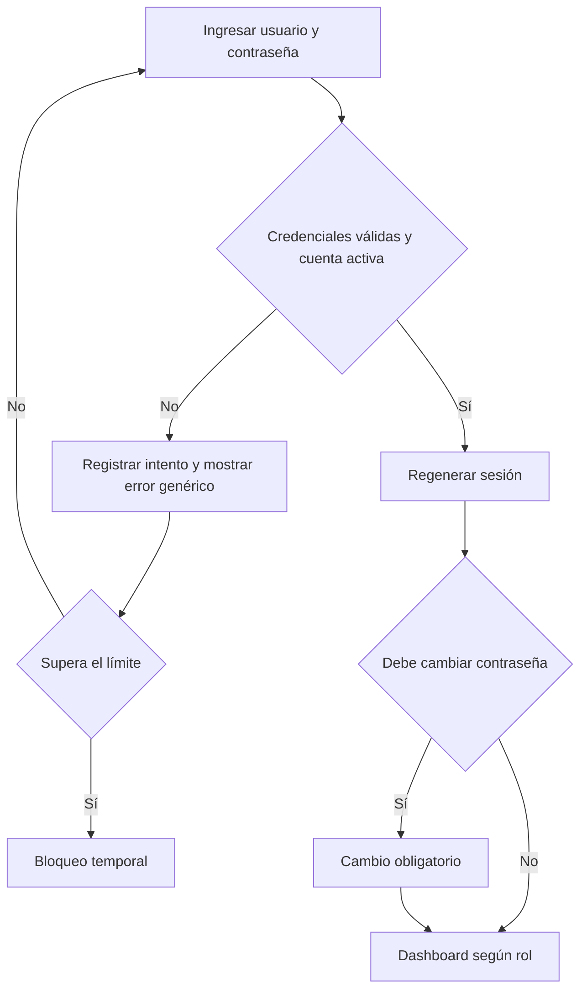
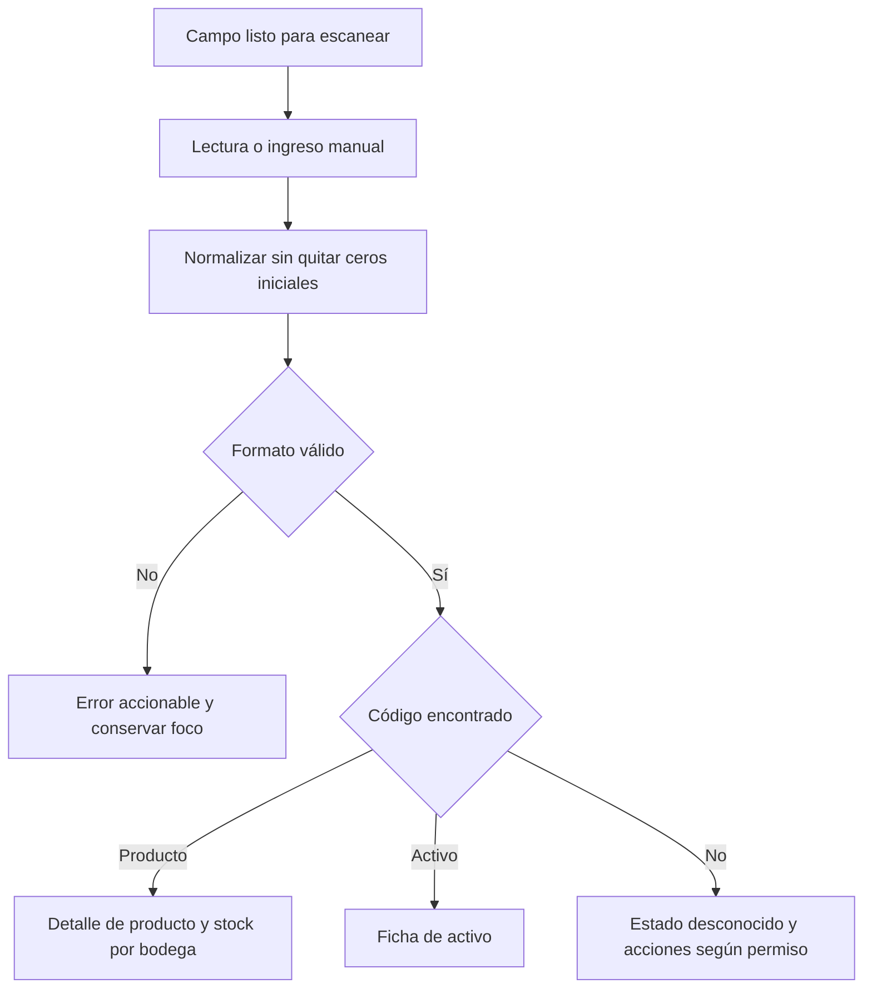
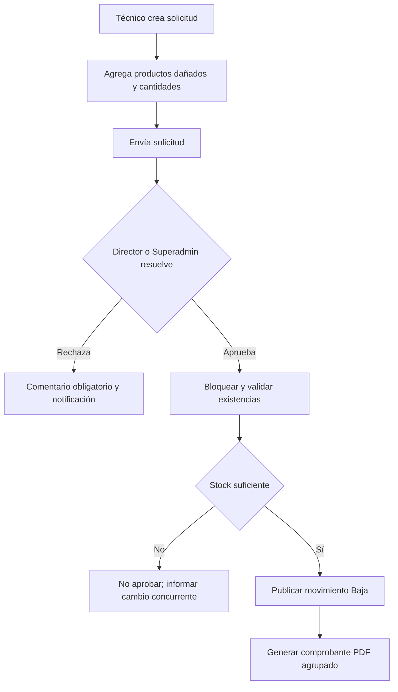
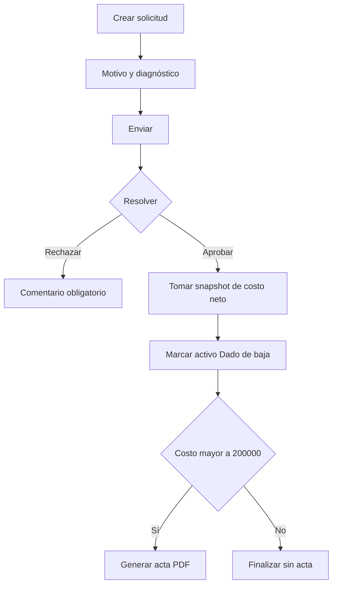

# Flujos de usuario y criterios de aceptación

## 1. Principios

- Cada operación muestra contexto, efecto y siguiente acción.
- Ninguna operación sensible se confirma desde una tabla sin resumen previo.
- Los borradores no cambian datos contables ni existencias.
- Los errores explican causa y recuperación.
- El escaneo acelera la búsqueda, pero nunca es la única forma de operar.

## 2. Inicio de sesión local

Criterios:

- El mensaje no revela si falló usuario, contraseña o estado.
- La sesión expira tras 30 minutos de inactividad.
- Un usuario desactivado no puede crear una nueva sesión.
- El primer acceso exige cambio de contraseña.
- Invitado nunca puede ejecutar rutas de escritura.

## 3. Escaneo global

Criterios:

- Un código devuelve como máximo una entidad.
- Dos `ENTER` inmediatos no duplican una acción.
- El lector no captura cuando el usuario escribe en otro campo.
- Un desconocido no se crea automáticamente.
- Invitado solo puede consultar.

## 4. Crear producto

1. Técnico abre Productos y selecciona Nuevo.
2. El sistema genera un código interno.
3. Técnico ingresa número de parte, nombre, categoría, costo neto, marca opcional y código de barras opcional.
4. El sistema valida duplicados.
5. Se muestra resumen.
6. Al confirmar se crea producto y bitácora.

Criterios:

- Número de parte obligatorio.
- Código de barras, si existe, contiene de 1 a 13 dígitos y es único globalmente.
- Costo neto no negativo.
- Crear producto no crea stock por sí solo.
- Cambios posteriores de costo conservan antes/después.

## 5. Entrada

1. Seleccionar bodega destino.
2. Escanear o buscar productos.
3. Agregar cantidades enteras positivas y costo neto aplicable.
4. Revisar resumen.
5. Publicar.

Criterios:

- La entrada publicada crea o incrementa existencia producto–bodega.
- Todos los detalles se confirman en una transacción.
- El doble envío produce un solo movimiento.
- El folio y nuevo saldo se muestran al finalizar.

## 6. Salida

1. Seleccionar bodega origen.
2. Seleccionar receptor: funcionario, sala, unidad o consumo técnico.
3. Completar datos obligatorios del receptor.
4. Escanear o buscar productos.
5. Ingresar cantidades.
6. Revisar stock actual y saldo resultante.
7. Publicar.

Criterios:

- Nunca permite cantidad superior a la disponible.
- Funcionario exige nombre y correo; departamento es opcional.
- Sala exige una ubicación activa de tipo sala.
- Consumo técnico permite referenciar un activo.
- Una falla en cualquier línea revierte toda la operación.

## 7. Devolución

1. Buscar salida original cuando exista.
2. Seleccionar productos y cantidades devueltas.
3. Clasificar cada línea como utilizable o dañada.
4. Utilizable vuelve a la bodega.
5. Dañada crea borrador de solicitud de baja y no vuelve al disponible.

Criterios:

- No se devuelve más que lo entregado sin justificación y permiso de Director.
- La devolución conserva referencia a la salida cuando fue localizada.
- La línea dañada no aumenta existencia utilizable.

## 8. Traslado entre bodegas

1. Elegir origen y destino distintos.
2. Agregar productos y cantidades.
3. Revisar saldos de ambas bodegas.
4. Publicar.

Criterios:

- Descuento y aumento son atómicos.
- Se bloquean filas de existencias en orden consistente.
- No se permite destino igual al origen.
- Nunca existe estado intermedio negativo.

## 9. Ajuste

1. Director o Superadministrador selecciona bodega y producto.
2. Informa cantidad contada o variación.
3. Indica motivo obligatorio.
4. Revisa saldo resultante.
5. Confirma.

Criterios:

- Técnico no puede acceder por URL directa.
- El ajuste nunca deja saldo negativo.
- La bitácora identifica valor anterior, nuevo y motivo.

## 10. Baja de stock

Criterios:

- Una solicitud puede contener varios productos.
- El stock cambia solo al aprobar.
- El PDF fallido queda pendiente de regeneración, sin deshacer la baja confirmada.
- Autoaprobación solo para Superadministrador con justificación adicional.

## 11. Registrar activo

1. Elegir tipo y sede.
2. Ingresar activo fijo obligatorio.
3. Ingresar código institucional opcional de 13 dígitos.
4. Ingresar marca, modelo, serie, costo neto y ubicación/responsable.
5. Si es PC, ingresar procesador.
6. Confirmar alta.

Criterios:

- Activo fijo único.
- Código institucional único cuando exista.
- PC sin procesador no se guarda.
- Alta crea evento inicial y bitácora.

## 12. Asignar o trasladar activo

1. Buscar o escanear activo.
2. Mostrar estado y asignación actuales.
3. Seleccionar nueva ubicación o funcionario.
4. Indicar motivo.
5. Fecha esperada de devolución opcional para funcionario.
6. Confirmar.

Criterios:

- Dado de baja no puede trasladarse.
- Responsable funcionario exige nombre y correo.
- No se permiten dos destinos actuales.
- La actualización y evento se guardan en una transacción.

## 13. Reparación

1. Técnico abre activo y selecciona Enviar a reparación.
2. Indica motivo, responsable y taller.
3. El activo cambia a En reparación.
4. Al finalizar se elige Operativo o No operativo y se documenta resultado.

Criterios:

- Se conservan inicio, fin, usuario, taller y resultado.
- Insumos usados se registran mediante salida por consumo técnico.
- No se crean órdenes de trabajo ni costos de mantenimiento.

## 14. Mover componente

1. Buscar componente.
2. Retirarlo del PC origen si corresponde.
3. Elegir PC destino o ubicación.
4. Indicar motivo.
5. Confirmar.

Criterios:

- Nunca queda instalado en dos PC.
- Origen, destino y evento cambian atómicamente.
- Dado de baja no puede instalarse.

## 15. Baja de activo

Criterios:

- Técnico puede solicitar, no aprobar.
- Director no aprueba una solicitud propia.
- Superadministrador puede autoaprobar con justificación reforzada.
- Costo exactamente $200.000 no genera acta.
- Costo ausente bloquea aprobación.
- Aprobación no elimina el activo.

## 16. Importación

1. Descargar plantilla.
2. Cargar archivo.
3. Validar sin guardar.
4. Revisar resumen y errores por fila.
5. Confirmar filas válidas.
6. Procesar por lotes.
7. Descargar resultado y rechazados.

Criterios:

- Repetir el mismo archivo genera advertencia por hash.
- Ninguna fila inválida se guarda silenciosamente.
- La importación registra usuario, archivo, conteos y errores.
- Datos de prueba nunca se cargan automáticamente en producción.

## 17. Reportes

1. Elegir reporte.
2. Aplicar filtros.
3. Previsualizar datos.
4. Generar PDF o Excel.
5. Descargar al completar.

Criterios:

- Todos los roles ven costos.
- Todo reporte lleva logo, sede, fecha, usuario y filtros.
- Exportaciones grandes se procesan en cola.
- La generación queda registrada en bitácora.

## 18. Recuperación de fallos

- Pérdida de red antes de publicar: conservar borrador y no cambiar stock.
- Pérdida de respuesta después de publicar: consultar idempotencia antes de reintentar.
- Correo fallido: reintentar en cola; no revertir operación.
- PDF fallido: marcar pendiente de regeneración y alertar.
- Deadlock MySQL: reintento acotado y seguro.
- Disco lleno o base no disponible: detener escrituras y mostrar estado operativo.

