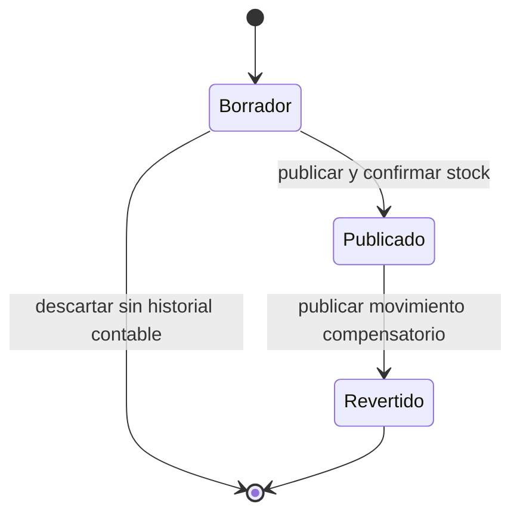
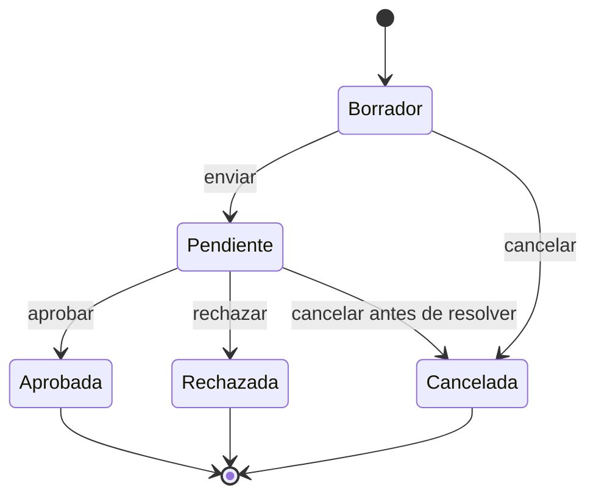
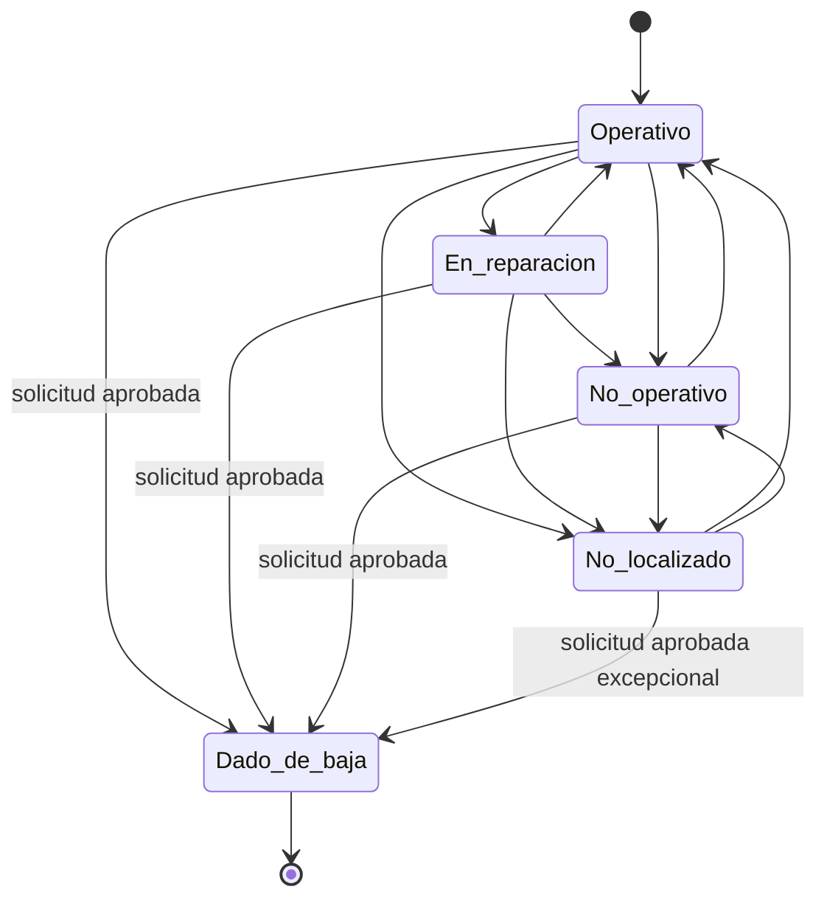
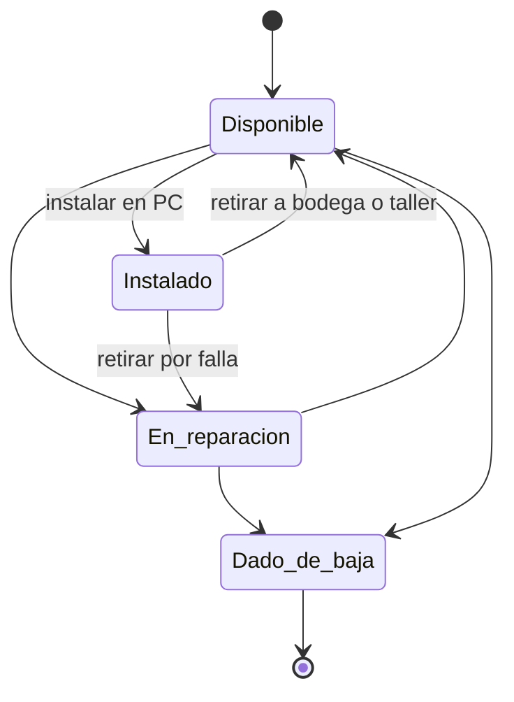

# Matriz de permisos y estados

## 1. Permisos por rol

| Acción | Invitado | Técnico | Director técnico | Superadministrador |
|---|:---:|:---:|:---:|:---:|
| Iniciar sesión y consultar dashboard | Sí | Sí | Sí | Sí |
| Ver productos, stock y costos | Sí | Sí | Sí | Sí |
| Exportar reportes permitidos | Sí | Sí | Sí | Sí |
| Crear producto | No | Sí | Sí | Sí |
| Editar producto y costo | No | Sí | Sí | Sí |
| Inactivar producto | No | No | Sí | Sí |
| Crear entrada, salida, devolución o traslado | No | Sí | Sí | Sí |
| Publicar movimiento propio válido | No | Sí | Sí | Sí |
| Realizar ajuste de stock | No | No | Sí | Sí |
| Revertir movimiento | No | No | Sí | Sí |
| Solicitar baja de stock | No | Sí | Sí | Sí |
| Aprobar baja de stock ajena | No | No | Sí | Sí |
| Autoaprobar baja de stock | No | No | No | Sí, excepcional |
| Ver activos y especificaciones | Sí | Sí | Sí | Sí |
| Crear o editar activo | No | Sí | Sí | Sí |
| Asignar o trasladar activo | No | Sí | Sí | Sí |
| Gestionar reparación | No | Sí | Sí | Sí |
| Gestionar componentes | No | Sí | Sí | Sí |
| Solicitar baja de activo | No | Sí | Sí | Sí |
| Aprobar baja de activo ajena | No | No | Sí | Sí |
| Autoaprobar baja de activo | No | No | No | Sí, excepcional |
| Gestionar sedes y ubicaciones | No | No | Sí | Sí |
| Gestionar categorías y tipos | No | No | Sí | Sí |
| Importar datos | No | Sí | Sí | Sí |
| Ver bitácora operativa | No | No | Sí | Sí |
| Ver auditoría técnica completa | No | No | No | Sí |
| Gestionar usuarios y roles | No | No | No | Sí |
| Configurar correo y respaldos | No | No | No | Sí |

Toda autorización se valida en el servidor mediante policies. La interfaz oculta acciones no permitidas, pero eso no constituye el control de seguridad.

## 2. Estados de movimientos

Reglas:

- Borrador puede editarse.
- Publicado es inmutable.
- Revertido conserva original y compensación.
- No existe eliminación de publicados.

## 3. Estados de solicitud de baja

Reglas:

- Solo el solicitante puede editar un borrador propio.
- Una solicitud pendiente es inmutable salvo resolución o cancelación admitida.
- La aprobación crea los eventos o movimientos correspondientes.
- Rechazar exige comentario.
- La autoaprobación solo existe para Superadministrador.

## 4. Estados de activos

Reglas:

- Dado de baja es terminal en la primera versión.
- No se asignan ni trasladan activos dados de baja.
- La baja de un activo no localizado requiere justificación explícita.
- Pendiente de baja no es un estado del activo.

## 5. Estados de componentes

## 6. Casos de autoaprobación del Superadministrador

La aplicación debe mostrar una confirmación de alto riesgo y exigir una justificación adicional. La operación registra:

- Solicitud y aprobación con el mismo usuario.
- Fecha y hora.
- IP y navegador.
- Justificación especial.
- Valores y activos/productos involucrados.
- Correlación de auditoría.
- Notificación al Director técnico activo.

No se agregará un segundo nivel de aprobación.

